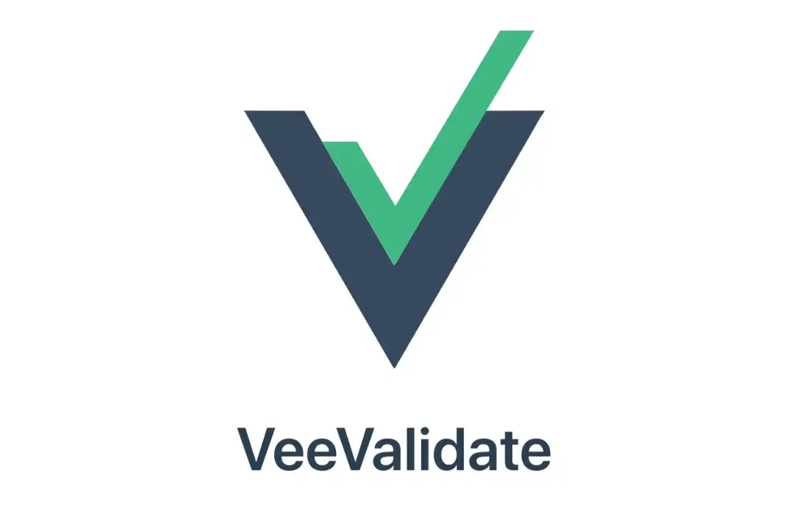

	&nbsp;
	&nbsp;
	&nbsp;
	&nbsp;

- 👋 Hi, I’m Bekzod
- 👀 I’m interested in junior web developer positions
- 🌱 I’m currently learning Vue.Js, FastAPI
- 📫 notarious2@gmail.com

### Tech Stack 
 

&emsp;&emsp;&emsp;  

&emsp;&emsp;&emsp;  

&emsp;&emsp;&emsp; 

 
<!---
notarious2/notarious2 is a ✨ special ✨ repository because its `README.md` (this file) appears on your GitHub profile.
You can click the Preview link to take a look at your changes.
--->
