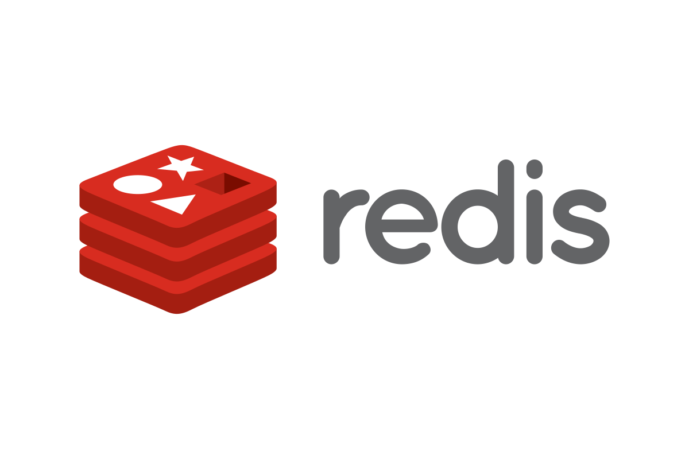

[](https://wakatime.com/@0c616174-c7c1-48f6-9407-9ec3030219ab)

<!--START_SECTION:waka-->

```txt
Total Time: 1,985 hrs 3 mins

Python            1,408 hrs 37 mins█████████████████▓░░░░░░░   70.96 %
Vue.js            265 hrs 17 mins ███▒░░░░░░░░░░░░░░░░░░░░░   13.36 %
HTML              110 hrs 2 mins  █▒░░░░░░░░░░░░░░░░░░░░░░░   05.54 %
JavaScript        63 hrs 1 min    ▓░░░░░░░░░░░░░░░░░░░░░░░░   03.17 %
YAML              34 hrs 35 mins  ▒░░░░░░░░░░░░░░░░░░░░░░░░   01.74 %
```

<!--END_SECTION:waka-->


<p align="center">
	<a href="https://www.linkedin.com/in/bekzod-mirahmedov-cfa-79b5b055"></a>&nbsp;
	<a href="https://telegram.me/notarious2"></a>&nbsp;
	<a href="mailto:notarious2@gmail.com"></a>&nbsp;
	
</p>


### Tech Stack 

&emsp;&emsp;&emsp;  


  &emsp;  

&emsp;&emsp;&emsp;  

&emsp;&emsp;&emsp;

 
<!---
notarious2/notarious2 is a ✨ special ✨ repository because its `README.md` (this file) appears on your GitHub profile.
You can click the Preview link to take a look at your changes.
--->
