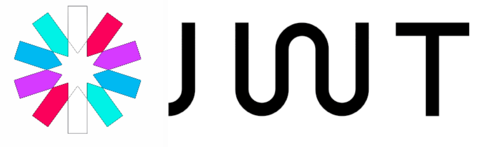
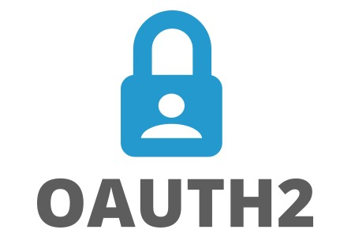

[](https://wakatime.com/@0c616174-c7c1-48f6-9407-9ec3030219ab)

<!--START_SECTION:waka-->

```text
Total Time: 356 hrs 58 mins

Python       197 hrs 29 mins █████████████▓░░░░░░░░░░░   55.33 %
HTML         87 hrs 27 mins  ██████░░░░░░░░░░░░░░░░░░░   24.50 %
Vue.js       26 hrs 13 mins  ██░░░░░░░░░░░░░░░░░░░░░░░   07.35 %
JavaScript   16 hrs 27 mins  █░░░░░░░░░░░░░░░░░░░░░░░░   04.61 %
YAML         5 hrs 54 mins   ▒░░░░░░░░░░░░░░░░░░░░░░░░   01.65 %
Text         5 hrs 33 mins   ▒░░░░░░░░░░░░░░░░░░░░░░░░   01.56 %
```

<!--END_SECTION:waka-->

<p></p>

<p align="center">
	<a href="https://www.linkedin.com/in/bekzod-mirahmedov-cfa-79b5b055"></a>&nbsp;
	<a href="https://telegram.me/notarious2"></a>&nbsp;
	<a href="mailto:notarious2@gmail.com"></a>&nbsp;
	<a href="https://www.facebook.com/bekzod.mirahmedov"></a>&nbsp;

</p>


- 👋 Hi, I’m Bekzod
- 👀 I’m interested in junior web developer positions
- 🌱 I’m currently learning Vue.Js, FastAPI
- 📫 notarious2@gmail.com

### Tech Stack 

&emsp;&emsp;&emsp;  


 &emsp;  

&emsp;&emsp;&emsp; 

&emsp;&emsp;&emsp;

 
<!---
notarious2/notarious2 is a ✨ special ✨ repository because its `README.md` (this file) appears on your GitHub profile.
You can click the Preview link to take a look at your changes.
--->
